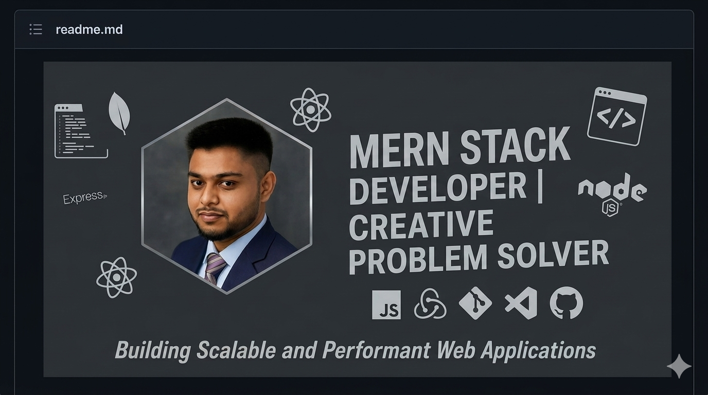

  
  <h1>Hi there, I'm Fahim Shareear 👋</h1>
  <h3>MERN Stack Developer | Creative Problem Solver</h3>

  

    📍 Jashore, Khulna Division, Bangladesh | 📧 <a href="fahimshareear@gmail.com">fahimshareear@gmail.com</a>
  

  

    
    
  

---

### 👨‍💻 About Me
I am a passionate **MERN Stack Developer** dedicated to building scalable and high-performance web applications. I love turning complex problems into simple, elegant, and efficient code. With a strong foundation in JavaScript, I focus on creating seamless user experiences.

- 🚀 Currently exploring **Next.js** and Server-side Rendering.
- 🛠️ Working on a **E-Commerce App** with real-time user interactivity.
- ⚡ Fun fact: I believe in writing code that is "human-readable" first, machine-executable second.

---

### 🛠️ Tech Stack & Skills

  

---

### 📂 Top Projects (Pinned)

#### 1. Project Title One
*Short overview of the project and why it's cool.*
- **Tech:** Next.js Tailwind, Express, Firebase, Cors
- **Link:** [Live Demo](https://lumina-omega-coral.vercel.app/) | [Source Code](https://github.com/fahim-shareear/lumina.git)

#### 2. Movie Master pro
*Short overview of the project and why it's cool.*
- **Tech:** MongoDB, Express, React, Node.js
- **Link:** [Live Demo](https://movie-master-pro-82ff4.web.app/) | [Source Code](https://github.com/username/repo)

#### 3. Zap-Shift Courier Service
*Short overview of the project and why it's cool.*
- **Tech:** React, Redux Toolkit, Node.js
- **Link:** [Live Demo](https://live-link.com) | [Source Code](https://github.com/fahim-shareear/zap-shift-main.git)

